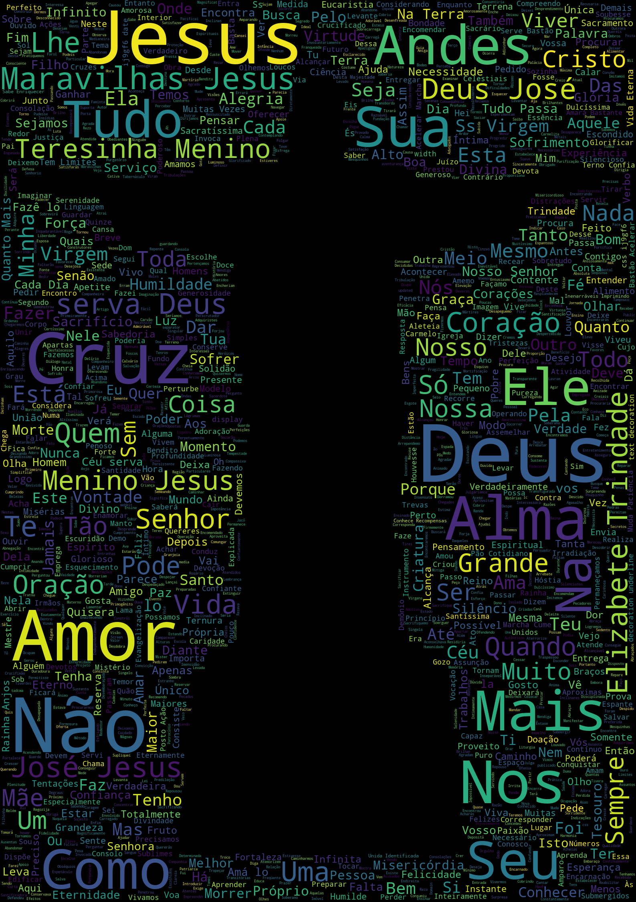

# Web Scraping e Wordcloud

  

Esse artigo, feito em Jupyter Notebook, tem o objetivo de mostrar técnicas de Web Scraping e Wordcloud com frases de Santos Católicos. 

Mais detalhes sobre sua construção podem ser encontrados [aqui](https://feduardomelo.medium.com/como-santos-cat%C3%B3licos-podem-te-ensinar-a-fazer-web-scraping-para-construir-um-wordcloud-usando-43ae12825ccf).